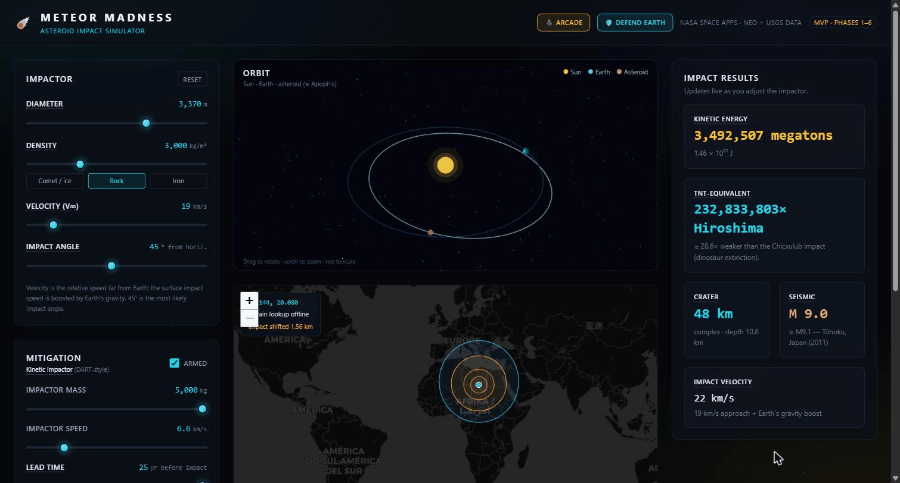
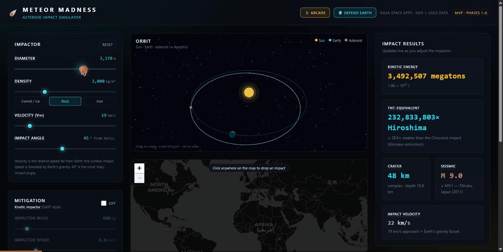
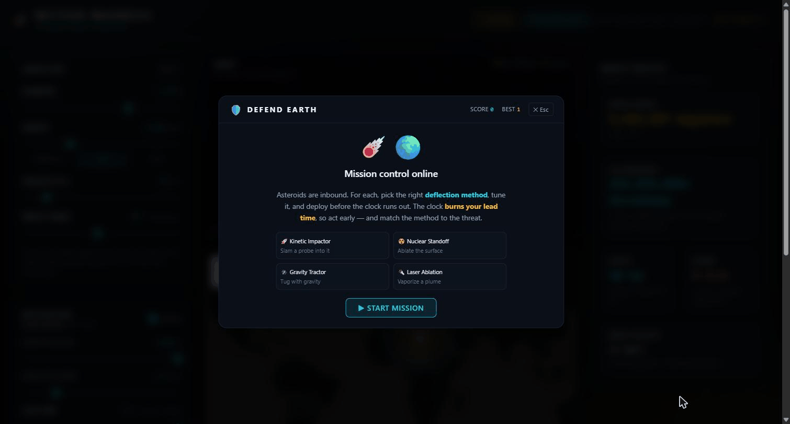

# ☄️ Meteor Madness — Asteroid Impact Simulator

> Pick (or invent) an asteroid, drop it on a point on Earth, and instantly see the energy
> released, the crater, the seismic magnitude, and the blast footprint — then try to deflect
> it and watch the impact point move (or miss Earth entirely).

Built for the **NASA Space Apps "Meteor Madness"** challenge: turn raw NASA NEO + USGS data
into a tool that lets anyone model an asteroid impact, understand the consequences, and test
planetary-defense strategies.



---

## 🎬 Demo

A 3.4-million-megaton stony impactor dropped on the map, then deflected with a kinetic impactor
applied years before impact — watch the live results, the blast rings, and the impact shift.



---

## ✨ Features

- **Live impact physics.** Sliders for diameter, density (comet / rock / iron presets),
  velocity, and impact angle drive instant results: kinetic energy (megatons + joules),
  TNT / Hiroshima equivalent, crater diameter & depth, seismic magnitude, and surface impact
  velocity (with Earth's escape-velocity boost folded in).
- **Plain-language context.** Every result is anchored to something real — "≈ the 2011 Tōhoku
  earthquake", "≈ comparable to the Tunguska event" — and small bodies are flagged as likely
  airbursts rather than ground impacts.
- **3D orbital view.** Sun, Earth, and the asteroid's orbital ellipse (≈ Apophis), rendered
  with three.js / react-three-fiber. Drag to rotate, scroll to zoom.
- **Clickable impact map.** Drop the asteroid anywhere on a Leaflet world map and see the
  crater and blast-radius rings drawn to scale, with ocean / land detection from USGS elevation.
- **Energy in context.** A log-scale chart comparing your impact against Hiroshima, Chelyabinsk,
  Tunguska, Castle Bravo, Mt. St. Helens, and more.
- **Planetary defense.** Arm a **kinetic impactor** (DART-style, with a momentum-enhancement
  factor β), tune the lead time, and watch the impact point shift — or move off Earth entirely.
  The teaching point is dramatic: *a tiny nudge applied years early beats a huge one applied
  days before impact.*
- **"Defend Earth" game mode** with four deflection strategies — Kinetic Impactor, Nuclear
  Standoff, Gravity Tractor, and Laser Ablation — plus an Arcade mode.
- **Real data, with an offline fallback.** Pulls live near-Earth objects from NASA's NEO API
  and Keplerian elements from JPL's SBDB, and degrades gracefully to bundled sample data and
  manual slider inputs when the network is unavailable.



---

## 🧮 The physics

The model follows **Collins, Melosh & Marcus (2005), "Earth Impact Effects Program,"
*Meteoritics & Planetary Science* 40.** All formulas live in `src/physics/` as pure,
fully-unit-tested functions:

| Module | What it computes |
| --- | --- |
| `energy.ts` | impactor mass, surface impact velocity, kinetic energy, TNT/megaton equivalent |
| `crater.ts` | transient & final crater diameter/depth (π-group scaling, simple vs. complex) |
| `seismic.ts` | impact energy → Richter magnitude |
| `blast.ts` | overpressure blast-radius rings |
| `deflection.ts` | kinetic-impactor Δv, gravity-tractor, laser-ablation & nuclear deflection |
| `orbital.ts` | Kepler solver (Newton–Raphson) → heliocentric position for the 3D orbit |
| `tsunami.ts` | simplified deep-water wave / run-up *(in progress)* |

> Estimates only — atmospheric entry is not modeled, and the blast rings and deflection shift
> are deliberately simplified for clarity and speed.

---

## 🛠️ Tech stack

- **Vite + React + TypeScript** — fast, fully client-side app
- **Tailwind CSS** — dark "mission control" theme
- **Zustand** — single global store (sim params → derived results → impact location → deflection)
- **three · @react-three/fiber · @react-three/drei** — 3D orbital view
- **react-leaflet · Leaflet** — 2D impact map
- **Recharts** — energy-comparison chart
- **Vitest** — physics unit tests

---

## 🚀 Getting started

```bash
npm install
npm run dev        # Vite dev server → http://localhost:5173
```

Other scripts:

```bash
npm run build      # type-check + production build
npm run test       # run the physics test suite (Vitest)
npm run typecheck  # tsc --noEmit
```

### NASA API key (optional)

The app works out of the box with NASA's `DEMO_KEY`, which is rate-limited. For smoother live
data, register a free key at <https://api.nasa.gov> and add it to a `.env` file:

```bash
cp .env.example .env
# then set VITE_NASA_API_KEY=your_key_here
```

---

## 🗂️ Project structure

```
src/
├── physics/     # pure, unit-tested impact & orbital math
├── data/        # NASA NEO + JPL SBDB and USGS API clients (with fallbacks)
├── scene/       # react-three-fiber orbit view (Sun, Earth, asteroid)
├── map/         # Leaflet impact map (crater + blast rings)
├── ui/          # control / results / mitigation panels, charts, game modes, tooltips
├── store/       # Zustand global store
└── lib/         # number/unit formatting + glossary
tests/           # Vitest physics tests
```

---

## 📡 Data sources

- **NASA NEO Web Service** — near-Earth object catalog, diameters, close-approach velocities
- **JPL Small-Body Database (SBDB)** — Keplerian orbital elements for named objects
- **USGS Elevation Point Query Service (EPQS)** — ocean vs. land detection at the impact point
- **USGS Earthquake Catalog** — real quakes to compare the impact's seismic magnitude against

---

## ✅ Testing

The physics module is the heart of the app and is covered by **47 passing unit tests** across
energy, crater, seismic, blast, orbital, deflection, and formatting helpers:

```bash
npm run test
```

---

## 👥 Team

- [@Tharusha101](https://github.com/Tharusha101)
- [@Dulina10](https://github.com/Dulina10) — Dulina Meththananda

---

## 🙏 Acknowledgments

- Impact physics: **Collins, Melosh & Marcus (2005)**, Earth Impact Effects Program
- Data: **NASA** (NEO API, JPL SBDB) and the **USGS** (elevation & earthquake catalogs)
- Built for **NASA Space Apps — Meteor Madness**
